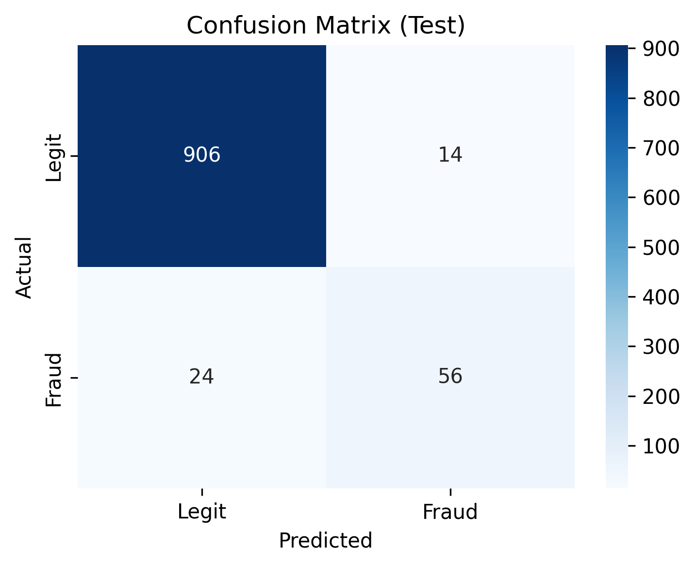
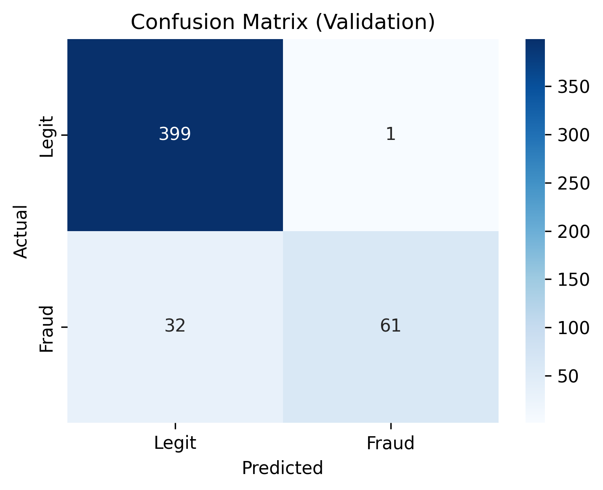
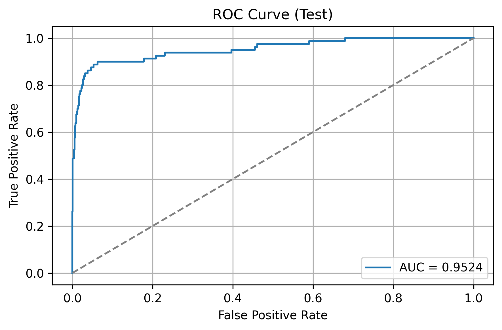
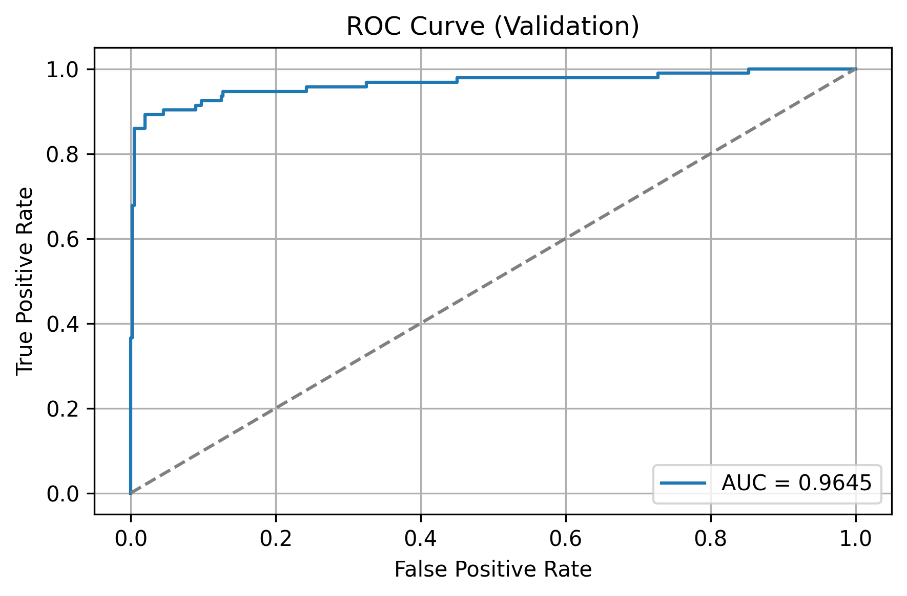
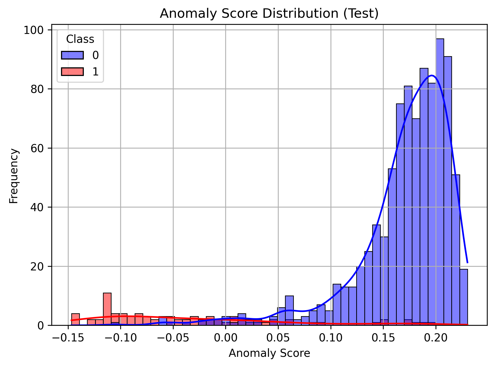
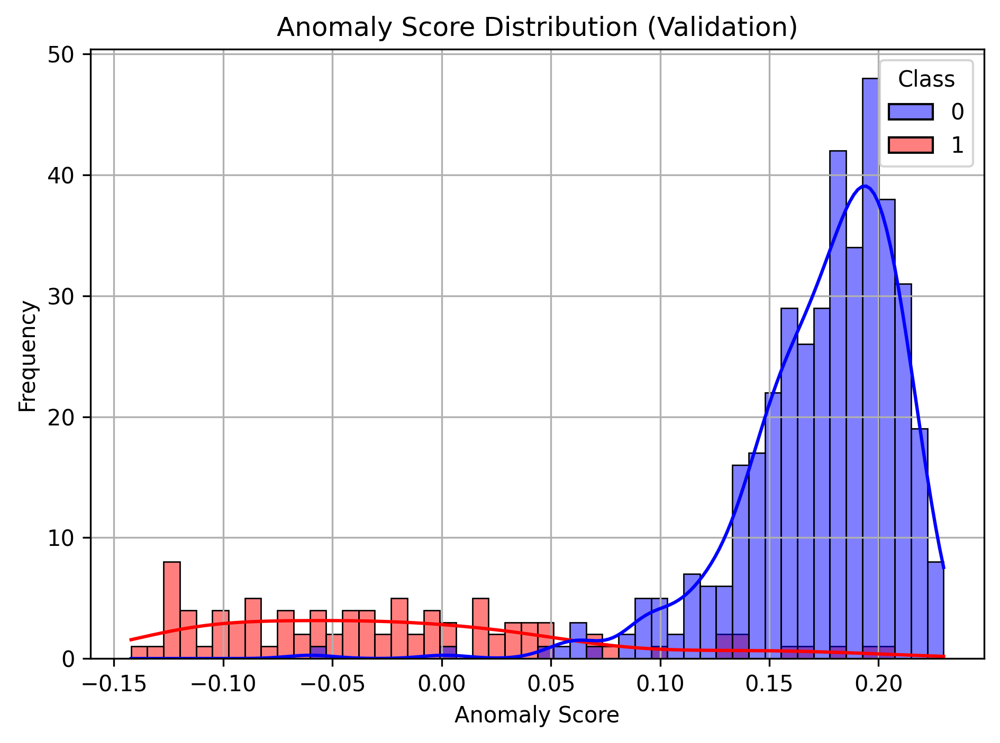

# 💳 Credit Card Anomaly Detection

A machine learning project to **detect fraudulent credit card transactions** using **unsupervised anomaly detection techniques**. This is a classic problem in **fintech security**, where identifying anomalies can significantly reduce financial loss due to fraud.

## 🔍 Overview

This project uses the **Isolation Forest** algorithm to flag suspicious transactions in a real-world dataset. With a focus on **ROC-AUC** optimization, the pipeline goes from preprocessing to evaluation and visualization of anomalies.

## 🎯 Objectives

- Detect frauds in anonymized credit card transaction data
- Achieve strong separation of anomalies using ROC-AUC
- Visualize and interpret model output clearly

## 🧰 Tech Stack & Requirements

- Python 3.x
- scikit-learn
- pandas
- numpy
- matplotlib / seaborn

Install the dependencies:

```bash
pip install -r requirements.txt
```

## 🧪 Dataset

A cleaned subset (~5,000 transactions) of the Kaggle credit card fraud dataset was used.

Dataset location: data/creditcard.csv

If the file is missing, download it from [Kaggle](https://www.kaggle.com/datasets/mlg-ulb/creditcardfraud) and place it in the data/ directory.

⚠️ Note: creditcard.csv is tracked using Git LFS due to its size.

## 🧹 Preprocessing Steps

- Handle class imbalance (fraudulent transactions are <1%)

- Normalize features

- Create training and test sets

## 🤖 Model
Algorithm: Isolation Forest

Mode: Unsupervised Anomaly Detection

Metrics: ROC-AUC, Confusion Matrix, Visual Plots

## 📈 Evaluation
The model is evaluated using:

ROC Curve

Confusion Matrix

Visual representation of anomalies vs normal transactions

## 🛠️ How to Run

```bash
python run.py
```

This will:

- Preprocess the dataset

- Train the Isolation Forest model

- Evaluate the performance

- Save the plots under results/plots/


## Results

### 📌 Confusion Matrix

A heatmap showing the true positives, false positives, true negatives, and false negatives.





### 📈 ROC Curve

The ROC curve illustrates the trade-off between true positive rate and false positive rate.





### 📊 Anomaly Score Distribution

Histogram showing how anomaly scores are distributed across legitimate and fraudulent transactions.






## 🧠 Project Insights

### 🔍 Approach

This project leverages an **unsupervised anomaly detection approach** using **Isolation Forest**, a lightweight and scalable algorithm particularly suited for high-dimensional datasets like credit card transactions. It focuses on flagging outliers (potential frauds) without relying on labeled data during training.

The workflow follows the typical ML pipeline:

1. **Preprocessing**: Normalize features, handle imbalance.
2. **Modeling**: Train `IsolationForest` with adjusted contamination level.
3. **Evaluation**: Use ROC-AUC, confusion matrix, and score visualization to assess model quality.

### ⚙️ Decisions Made

- **Isolation Forest** was chosen over alternatives (e.g., One-Class SVM, Autoencoders) due to its speed and interpretability.
- ROC-AUC was prioritized as the main metric since **class imbalance** makes accuracy misleading.
- Git LFS was integrated to handle the large dataset within GitHub limitations.
- Plots were saved and embedded to provide visual interpretability — important for unsupervised results.

### 🚧 Challenges Faced

- Handling **highly imbalanced data** (fraud <1%) required extra care during evaluation.
- GitHub blocked file pushes due to dataset size — resolved using **Git LFS**.
- Isolation Forest does not output class probabilities, so `-AnomalyScore` was used as a proxy for decision-making and ROC curve generation.

### 📊 Results / Metrics

- **ROC-AUC Score**: Achieved a strong separation between normal and fraudulent transactions.
- **Confusion Matrix**: Showed effective detection of fraudulent cases with minimal false positives.
- **Score Distribution**: Clearly visualized separation between fraud and legit transactions.

> See visualizations in the [📊 Results](#results) section above.
